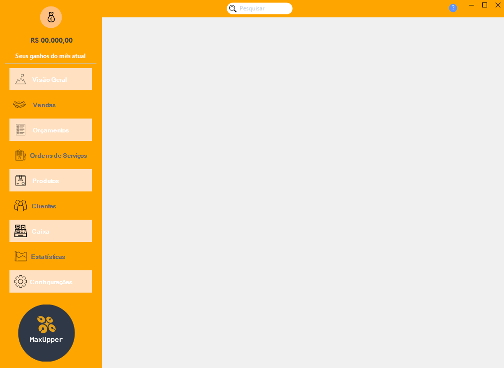

# Projeto Max Upper

Este Software Open-Source está sendo desenvolvido em C#, cujo seu principal objetivo é gerenciar dados de maneira fácil, visível, intuitiva e organizada.

## Suas Funções
Com o Max Upper você ganha super poderes em seu negócio!

1. Visão Geral 

*Com ela você poderá visualizar todos os status importantes como: Graficos e detalhes (Ordens de Serviços e Vendas) e Espaço para avisos.*

2. Vendas

*Realize vendas para seu cliente, controle seu caixa e tenha detalhes de todas as vendas.*  

3. Orçamentos

*Faça rapidamente um orçamento com seus produtos de seu estoque, adicione novos itens e tenha acesso de todos os orçamentos.*

4. Produtos

*Cadastre itens em seu estoque, verifique os itens que estão com baixo saldo, faça pedido de cotação de forma rapída, edite valores e suas descrições.*

5. Financeiro

*Obtenha detalhes expecificos de sua loja tanto em saldo positivo como em negativos.*

<h2>Viu como é fácil gerenciar seu negócio?</h2>

# Max Upper é feito para você
Com seu sistema de loguin possibilita que cada usuario tenha sua base de dados para acessa-lo. Basta se registrar e efetuar o login. 

 # Atenção
 Ainda estamos em desenvolvimento e infelizmente não temos um prazo para concluir todo o projeto! Pedimos paciência pois já estamos trabalhando nisso.

